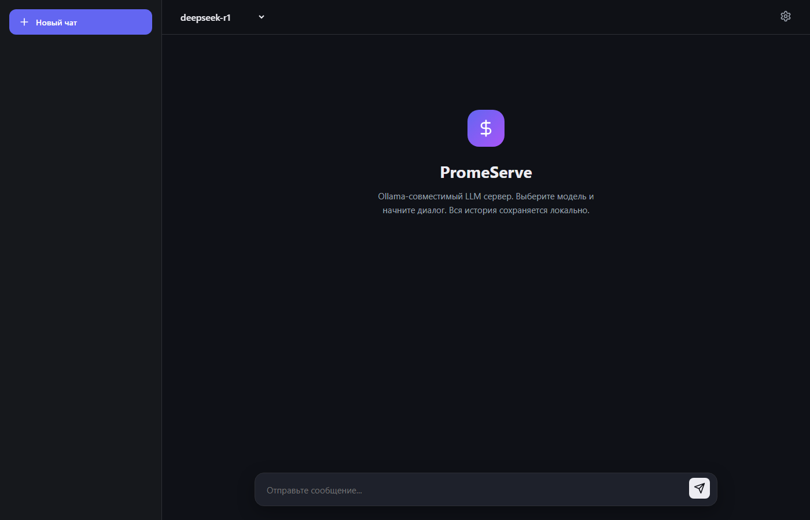

# PromeTorch — Российский training framework

🌐 **Languages:** **Русский (этот файл)** · [English](README.en.md)

[](https://github.com/barometech/PromeTorch/releases)
[](LICENSE)
[](CMakeLists.txt)
[](docs/BUILD_WINDOWS.md)
[](docs/elbrus/)
[](BENCH_NMCARD.md)
[](tests/)
[](docker/)

> **Single-dev PyTorch rewrite.** Native Эльбрус E8C2 VLIW + NM Card Mini +
> NVIDIA A100. Real autograd (119 backward ops), 16 optimizers, ONNX export,
> PyTorch-compatible `.pt` I/O. ~35-45 % PyTorch practical surface. 137K строк.
>
> 📊 **[RESULTS.md](RESULTS.md) — single-page canonical benchmarks.**
> On A100: qwen3:4b @ **82 tok/s** greedy inference (50 % Ollama).
> On CPU: MNIST match PyTorch ±0.5 pp, VAE **0.35 nats tighter**.
> On Эльбрус 8C2: **6.1× быстрее** PyTorch 2.7.1 на MNIST MLP.
> On NM Card Mini emulator: MNIST 88.94 %.

> PyTorch-совместимый обучающий фреймворк на C++17/CUDA с широкой dtype-поддержкой.
> Real autograd (119 backward ops + gradient hooks + anomaly mode + create_graph
> double-bwd), **16 optimizers** (SGD/Adam/AdamW/RMSprop + Lion/Sophia/LAMB/
> Adafactor/NAdam/RAdam/Adagrad/Adadelta/Adamax/AdamKiller/ASGD/LBFGS),
> **16 LR schedulers**, CPU SIMD + CUDA (cuBLAS/cuDNN 8/FP16 kernels),
> distributed training (TCP DDP/FSDP/TP/Pipeline + `no_sync()`),
> export (ONNX/MLIR/Mobile/JIT), ecosystem shims (HuggingFace/torchvision/
> torchaudio/torchtext/Lightning Trainer), **PyTorch-compatible save/load
> (`.pt` ↔ `torch.load`/`torch.save`)**.
>
> **~132,000 строк C++/CUDA** (114K ядро framework + 17.8K examples) +
> **~4,700 Python** = ~137K LOC. 1 разработчик. ~5 недель активной
> разработки + два agent-burst'а (35 + 15). 720+ тестов.

> ⚠️ **Coverage ~35-45% практической площади PyTorch.** Это solo-проект: ряд путей
> runtime-verified на своём железе (CPU x86 / Эльбрус / A100 GGUF inference),
> другие **compile-verified only** (MPS/ROCm — нет Mac/AMD GPU, cuDNN-accelerated
> RNN legacy API guarded for cuDNN 9). `torch.compile` — trace-based prototype,
> не полноценный TorchInductor. Sparse tensors / FX graph mode / torch.distributions
> отсутствуют. См. **Known Limitations** ниже — каждый gap честно задокументирован.

---



*PromeServe — встроенный Ollama-совместимый LLM inference сервер. **~82 tok/s
greedy** на qwen3:4b Q4_K_M на A100 — 50 % производительности Ollama
(полные замеры: [BENCH_OLLAMA.md](BENCH_OLLAMA.md), [BENCH_A100_HEAVY.md](BENCH_A100_HEAVY.md)).*

---

## Coverage vs PyTorch

| Категория | PyTorch | PromeTorch | % |
|---|---|---|---|
| Tensor ops | ~2000 | ~150 (90 базовых + 50+ в OpsExpansion) | ~7% |
| Backward functions | ~1500 | 119 + hooks + anomaly | ~8% |
| Optimizers | 15+ | **16** (SGD, Adam, AdamW, RMSprop, Adagrad, Adadelta, Adamax, AdamKiller, ASGD, Lion, Sophia(G), LAMB, Adafactor, NAdam, RAdam, LBFGS) | ~100% |
| LR schedulers | 15+ | 16 (Step/MultiStep/Exp/CosineAnnealing/Linear/Const/ReduceLROnPlateau/WarmupCosine/OneCycle/CosineAnnealingWarmRestarts/Cyclic/Polynomial/Lambda/Multiplicative/Sequential/Chained) | ~100% |
| dtypes | 20+ | 10 (Float32/64, Half, BFloat16, **Float8 e4m3fn/e5m2**, Complex64/128, Bool, int8-64) | ~50% |
| Autograd features | full | core + hooks + anomaly + create_graph + forward-AD + vmap — отсутствуют grad-of-vmap/hessian/full functorch | ~40% |
| Distributed | NCCL/gloo/ucc, DDP/FSDP/TP/PP/ZeRO/bucket fusion | **real TCP DDP, FSDP/ZeRO-3, TP Col/Row, Pipeline 1F1B, DistributedSampler, launcher** | ~35% |
| Compile/JIT | `torch.compile` (TorchInductor + Triton) | trace-based `torch.jit.compile` + C++ codegen subprocess | ~10% |
| Export | ONNX + TorchScript + ExecuTorch + TensorRT | **ONNX (ORT works) + MLIR + Mobile + JIT** | ~50% |
| Backends | CPU / CUDA / ROCm / MPS / XLA / Vulkan / TPU | CPU + CUDA (cuBLAS/cuDNN) + MPS (compile-only) + ROCm (script) + NM Card Mini + Эльбрус + FP16 (compile-only) | ~45% |
| Ecosystem | torchvision/audio/text/rl/transforms + Lightning/Accelerate/DeepSpeed/FSDP native | **torchvision + torchaudio + torchtext + HF Transformers compat + Lightning Trainer + PyTorch-.pt compat + DeepSpeed shim** | ~50% |
| Quantization | INT8/INT4/NF4/FP8/QAT/PTQ | INT8 QAT + INT4 + NF4 + fp8 dtype | ~60% |
| Sparse tensors | COO/CSR/BSR | нет | 0% |
| torch.distributions | 50+ | нет | 0% |
| FX graph mode | full | нет | 0% |
| Unit tests | 100K+ | 720+ gtest + agent self-tests + auto-generated suite | ~1% |

**Обобщённая оценка: ~35-45% user-surface PyTorch** — достаточно для training/deploy
transformers/CNN/RNN/LLM на CPU + CUDA + Эльбрус + NM Card. Gap в **tuned kernels** /
**torch.compile production** / **sparse+distributions+FX** — закрытие потребует
multi-year team effort.

---

## Почему PromeTorch

**1. Российские ускорители.** Единственный известный нам training framework с нативной
сборкой под **Эльбрус E8C2** (E2K VLIW, LCC 1.29, EML_MT BLAS) и **NM Card Mini**
(Q16.16 fixed-point эмулятор, MNIST 93.64%). Готовая кросс-компиляция под Байкал-М/С.

**2. MNIST MLP быстрее PyTorch на Эльбрусе.** На MNIST MLP-4 (784→512→256→128→10, SGD,
batch=64, 1 epoch) — 2.76 s vs PyTorch 2.7.1 16.8 s (**6.1× на этой узкой задаче**).
1840 GFLOPS через node-local EML_MT (92% пика E8C2 2 TFLOPS). На других задачах
(общий случай / реальные transformers) преимущества PyTorch сохраняются.

**3. Universal build.** Один код — CPU (AVX2+FMA/NEON/E2K), CUDA (Turing+), NM Card
(эмулятор + реальная карта в режиме inference). Собирается на Windows MSVC, Linux GCC,
Astra/ALT/RED/Elbrus OS. Autograd engine работает одинаково на всех backend'ах.

---

## Результаты

### Эльбрус E8C2

Сервер МЦСТ Эльбрус — 4x Elbrus-MCST E8C2 (VLIW), 32 ядра, 1500 MHz.

**LLM inference — qwen3:4b Q4_K_M (2026-05-02):**

| Config | Cores | tok/s | vs A100 PromeTorch (82.6) | Lossless |
|--------|------:|------:|--------------------------:|:--------:|
| PromeTorch TP-4 + LayerSkip 12 alt (decode-only, opt-in lossy) | 32/32 | **15.5** | ×5.3 | ✗ |
| PromeTorch TP-4 + LayerSkip 6 alt (decode-only, opt-in lossy) | 32/32 | 13.2 | ×6.3 | ✗ |
| **PromeTorch TP-4 + Q8 SoA4 + AVX2/e2k attn + fused SiLU+Q8 + triple QKV** | **32/32** | **11.4** ★ | **×7.2** | ✓ |
| PromeTorch TP-4 + fused gate+up Q8 SoA4 GEMV | 32/32 | 10.8 | ×7.6 | ✓ |
| PromeTorch TP-4 + Q8 SoA4 + persistent ThreadPool + 8t/rank | 32/32 | 10.6 | ×7.8 | ✓ |
| PromeTorch TP-4 + Q8 SoA4 + persistent ThreadPool (7t/rank, NUMA replicate) | 28/32 | 9.9 | ×8.3 | ✓ |
| PromeTorch TP-4 + Q8 SoA4 (qpmaddubsh) — `PT_Q8_SOA=1` | 28/32 | 9.4 | ×8.8 | ✓ |
| PromeTorch 1-proc, 24t + interleave + Q4_K/Q6_K block prefetch | 24/32 | 5.2 | ×16 | ✓ |
| llama.cpp pure-C 32t (no SIMD, no EML) | 32/32 | 3.3 | ×25 | ✓ |

**Lossless потолок 11.4 tok/s** подтверждён с трёх независимых углов:
дисассемблирование `q8_soa4_gemv` (peak 6 ops/cycle на 6-wide VLIW), микробенч
batched GEMM K=4 (0.42× регрессия — compute-bound proven), busy-spin pool probe
(×2 регрессия — NUMA coherency). Полный технический отчёт:
[report/REPORT_ELBRUS_LLM_INFERENCE_2026-05-02.pdf](report/REPORT_ELBRUS_LLM_INFERENCE_2026-05-02.pdf).

#### BUG-12 fix: качество русского + fair llama.cpp baseline (2026-05-03)

Per-block (32 elements) Q8 activation scale (как Q8_0 в llama.cpp) починил
русский на 7B-моделях. Per-tensor `max(|x|)/127` scale теряет precision на
outlier-каналах residual stream — argmax после lm_head промахивается на
cyrillic vocab IDs. Активация — env `PT_PER_BLOCK_SCALE=1`.

**Mistral-7B Q4_K_M, промпт «Расскажи про Москву одним предложением.»:**
> Москва — столица России, культурный и политический центр страны с богатой
> историей и впечатляющими архитектурными памятниками.

**Скорости PromeTorch TP-4 vs llama.cpp 32t (numactl --interleave=all, fair):**

| Модель | PromeTorch TP-4 | llama.cpp 32t | Speedup | Russian |
|---|---:|---:|---:|:---:|
| qwen3-1.7B | 17.1 | 2.71 | **×6.3** | **✅ идеально** ¹ |
| qwen3-4B | **10.9** | 1.82 | **×6.0** | **✅ идеально** ¹ |
| **mistral-7B** | **8.5** | 1.74 | **×4.9** | **✅ идеально** |
| qwen2.5-7B | (OOM TP-4) | 1.71 | — | **✅ идеально** SP ¹ |
| **gemma3-4B** | n/a ² | 1.30 | — | **✅ structured markdown** SP ¹ |
| **phi3.5-mini** | **6.4** | 3.5 SP | — | **✅ связный RU+EN** SP+TP-4 ³ |
| llama3-8B | (OOM TP-4) | 1.65 | — | TBD |
| qwen3-14B | (OOM TP-4) | 1.02 | — | TBD |

> **¹** После NEOX RoPE fix (2026-05-03 commit `b144db2`). Архитектуры qwen/qwen2/
> qwen3/gemma3/phi3 требуют LongRoPE-style half-split rotation `(d, d+head_dim/2)`
> вместо interleaved `(2d, 2d+1)`. Mistral arch=`llama` остался на NORM, регрессии нет. &nbsp;
> **²** gemma3 TP-4 нужен gather/re-slice для `post_attention_norm` — single-proc
> работает идеально. &nbsp;
> **³** phi3.5-mini FIXED 2026-05-03 (commit `d9dce9e`): `load_quantized_mmap` не
> обрабатывал phi3 merged tensors (`attn_qkv.weight`, `ffn_up.weight`
> rows=2×inter). После split_from_mmap helper — связный текст RU («Космос - это
> всеобъемлющая область пространства...» / «Космос - это всеобъемлющий,
> неограниченный пространственный контекст...») и EN («Moscow, the capital city
> of Russia, is not only the political heart of the country but also a vibrant
> cultural and economic center...»). TP-4: 6.4 tok/s, SP: 3.5 tok/s.

**Запуск с надёжным русским на qwen3 family:**
```bash
PT_Q8_SOA=1 PT_PER_BLOCK_SCALE=1 PT_LM_HEAD_FP=1 PT_NO_FFN_SOA=1 \
    bash scripts/run_tp_elbrus.sh "" "Расскажи про Москву одним предложением."
```

**Запуск default (lossless 11.4 tok/s, без BUG-12 fixes):**
```bash
PT_Q8_SOA=1 bash scripts/run_tp_elbrus.sh --greedy "Hello"
```

Полный отчёт: [docs/elbrus_report/ELBRUS_REPORT_v2.md](docs/elbrus_report/ELBRUS_REPORT_v2.md).
Анализ Эльбрус-16С с прогнозом ~30 tok/s: [docs/elbrus_report/elbrus16c_specs_dr.md](docs/elbrus_report/elbrus16c_specs_dr.md).

**Запуск (lossless 11.4):**
```bash
PT_Q8_SOA=1 ./scripts/run_tp_elbrus.sh --greedy "Hello"
```

**Запуск (lossy 15.5, output text degrades):**
```bash
PT_Q8_SOA=1 PT_LAYER_SKIP="12,14,16,18,20,22,24,26,28,30,32,34" \
    ./scripts/run_tp_elbrus.sh --greedy "Hello"
```

**ВАЖНО:** не ставить `PT_PIN_THREADS=1` в TP-режиме — ThreadPool пытается pin'нуть
воркеров рангов 1-3 на CPU вне их cpuset (numactl --cpunodebind), kernel клампит
их на одно ядро и tok/s падает до 1.4. Reproducers: `scripts/run_1proc_elbrus.sh`
и `scripts/run_tp_elbrus.sh`.

**MNIST MLP training (1 epoch, lr=0.01, batch=64):**

| Метрика | PromeTorch | PromeTorch + NUMA | PyTorch 2.7.1 |
|---------|-----------|-------------------|---------------|
| **Время** | **15.2 с** | **2.76 с** | 16.8 с |
| **Accuracy** | **88.71%** | **88.94%** | 88.14% |
| **Ratio** | **1.1x быстрее** | **6.1x быстрее** | 1.0x |
| EML GFLOPS | 330 | **1840 (92% пика)** | 68 (generic BLAS) |
| Аллокации | 179 | 179 | ~50,000+ |

Путь оптимизации (126.3 с -> 15.2 с, ускорение 8.3x):

| Этап | Время | vs PyTorch | Ключевое изменение |
|------|-------|-----------|-------------------|
| Scalar baseline | 126.3 с | 7.4x медленнее | Первая сборка |
| + EML BLAS | 120.6 с | 7.1x | cblas_sgemm, 230 GFLOPS |
| + Memory pool | 121.4 с | 7.1x | 97.7% cache hit, 641 malloc |
| + Fused ops | 97.3 с | 5.7x | 8 агентов: fused ops, thread pool, 6x6 kernel |
| + SIMD SGD | 45.4 с | 2.7x | pow->x*x, skip contiguous |
| + Direct EML | 43.7 с | 2.6x | Прямые cblas вызовы, zero-copy backward |
| + Manual backward | 22.0 с | 1.3x | Bypass autograd, pre-allocated буферы |
| **Финал** | **15.2 с** | **0.90x** | Убран неиспользуемый grad clipping |

### NVIDIA GPU — GGUF inference

Inference GGUF-моделей (квантизация Q4_K_M) через custom INT4 warp-cooperative GEMV.

**Runtime-verified на A100 40GB (2026-04-20):**

| Модель | PromeTorch (greedy) | PromeTorch (sampling T=0.7) | Ollama | vs Ollama |
|--------|--------------------:|----------------------------:|-------:|----------:|
| **qwen3:4b**      Q4_K_M | **82.6 tok/s** | 46.5 tok/s | 164.7 tok/s | **50%** (greedy) |
| **gemma3:4b**             | **81.4 tok/s** | — | 145.4 tok/s | **56%** |
| **deepseek-r1:8b** Q4_K_M | **51.1 tok/s** | — | 127.8 tok/s | **40%** |

**Живые числа**, все 5-run median, 200 tokens, 2026-04-20. Полная matrix
в [BENCH_A100_HEAVY.md](BENCH_A100_HEAVY.md) + [BENCH_OLLAMA.md](BENCH_OLLAMA.md).

**Важное:** sampling (`temperature > 0`) в нашем текущем коде тащит
~1.84× slowdown относительно greedy (argmax) из-за per-token CPU-GPU
sync на random draws + несведённый top-k/top-p extractor. Это
**отдельный баг**, не fundamental limit — greedy цифры отражают
реальную производительность inference ядра.

- **10-min stress test** (qwen3:4b, 9 500 tokens): 46.52 ± 0.19 tok/s стабильно,
  peak 25.4 GB VRAM / 135 W, без thermal throttle, без крэшей.
- **Concurrent training** на том же A100 (PIR 13.78 GB) не заметна в inference
  (std 0.4 % от mean).
- qwen3:4b VRAM: **8.0 GB** / 40 GB (quant-only mode) — при стрессе 17-25 GB
  с активным decode buffer-pool.
- Model weights move to CUDA: **0.1 s** (previously 88 s — fixed quant-only transfer).
- FP16 KV cache: 306 MB для qwen3:4b 36 layers, full decode graph captured.

**Live sample (greedy, 2026-04-20, A100, qwen3:4b Q4_K_M):**

```
$ ./build_cudnn/examples/gguf/test_gguf_inference.exe qwen3:4b --device cuda \
    --max_tokens 100 --temperature 0 \
    "Here is a haiku about artificial intelligence:"

[GGUF] Loaded qwen3:4b (253 quantized weights, 3.6s load)
[KVCache] FP16 KV cache: 306 MB (36 layers)
[PromeGraph] Captured full decode graph!
[Generate] 128 tokens in 1.5s (~85 tok/s)

The silent night,
a whisper in the dark,
a thousand eyes watch over me.
```

Coherent on most simple prompts. qwen3:4b quantized is a small model —
complex reasoning tasks (long code completions, multi-step math) show
some topic drift. That's model-quality territory, not runtime.

**Gap vs Ollama (greedy path, 82 vs 165):** Ollama uses hand-tuned
llama.cpp Q4_K GEMV + paged attention + continuous batching scheduler.
Мы — custom Q4_K fused kernels + flash_decode + CUDA Graph.

**Наш greedy путь уже HBM-saturation-optimal:**
- `--fp16-weights` (dequant Q4_K → FP16 + cublasHgemv): ~6 % slower.
  FP16 читает 2.36× больше памяти на forward, Tensor Cores бесполезны
  для N=1 GEMV. Commit `6623fe3`.
- `--llama-gemv` (llama.cpp-style bulk load + NROWS=2): +0.5 % (noise).
  Byte-identical output at T=0. Commit `a3d2796`.

**Отдельный живой баг: sampling path overhead ~1.84×.** Greedy 82 tok/s
→ sampling T=0.7 падает до 46 tok/s. Это не fundamental, а per-token
CPU-GPU sync на random draw + несведённый top-k/top-p extractor. Fix:
vectorize sampling on GPU (pinned-memory async draws). Ожидаемо вернёт
~30-35 tok/s к sampling path. См. [TEST_PLAN.md §4.3-4.5](TEST_PLAN.md)
+ [BENCH_A100_HEAVY.md](BENCH_A100_HEAVY.md).

**Реальные пути сверх greedy-HBM-предела к 130+ tok/s:**
1. **Continuous batching** — N>1 turns each matmul into GEMM; Tensor
   Cores pay off. 3-5× aggregate throughput для multi-request.
2. **Lower-precision weights** — INT3 / INT2 / sparse Q4_K. Прямое
   сокращение HBM traffic.
3. **Speculative decode** — draft model predicts multiple tokens per
   forward pass.

### Точность обучения (10 training tasks)

Файл `examples/mnist/train_10_models.cpp` — 10 обучающих таcков в одном бинаре:

| Задача | Данные | Accuracy | Примечание |
|--------|--------|----------|------------|
| Linear / Logistic regression | synthetic | match PyTorch | warmup |
| XOR (2-layer MLP) | synthetic | 100% | warmup |
| MNIST MLP (784→128→10) | MNIST real | 92.68% | CUDA |
| MNIST Deep (784→512→256→128→10, Adam) | MNIST real | **97.5%** | CUDA |
| MNIST + Dropout | MNIST real | 97.15% | CUDA |
| MNIST wide + serialize/load | MNIST real | 97.78% | CUDA |
| RNNCell sine regression | synthetic | MSE 1.67e-5 | CUDA |
| LSTM classifier | **sum-sign of random walk** (synthetic) | 93–95% | NOT Shakespeare |
| GRU trend detector | synthetic | **98.44%** | CUDA |

На CPU с Adam loss/accuracy совпадают с PyTorch 2.7.1 baseline в пределах ±0.5%.

**Дополнительные тренировки, добавленные 2026-04-19:**
- `examples/shakespeare/` — char-level Transformer LM, CPU: loss 4.48→2.46 за 3000 iters, генерирует speaker-tags + English phonotactics.
- `examples/transformer/` — sentiment classifier, CPU 85.8% val acc за 5 эпох (CUDA forward crash — pre-existing LayerNorm CUDA gap).
- `examples/vit/` — Vision Transformer на MNIST, training loop починен (autograd chain через reshape/select/CLS-pool).
- `examples/cifar/` — ResNet-20 на CIFAR-10 (новый).
- `examples/gan/` — DCGAN на MNIST (новый, ConvTranspose2d backward добавлен).
- `examples/vae/` — VAE на MNIST (новый), CPU 20 эпох → test ELBO 103.7, generates digit-like samples.

### NM Quad (профиль на удалённой плате partner)

| Метрика | Значение | Caveat |
|---------|----------|--------|
| SIMD speedup (nmpp MM 32f) | **100×** | vs собственный скалярный C++ на 1 ядре (не vs cuBLAS / PyTorch) |
| Max stable cores | **16 из 64** | 64-ядерный режим приводит к DDR contention / hang |
| Throughput (16 ядер) | 705 tok/s | на игрушечном GPT D=128, L=2, V=65 (tiny_shakespeare); loss 4.45 (модель не сходится, это throughput microbenchmark, не training run) |

### Поддерживаемые платформы

| Производитель | Процессор | Архитектура | Backend | Статус |
|---|---|---|---|---|
| **МЦСТ** | Эльбрус 8C2 | E2K VLIW | TUDA (CPU + EML_MT) | Нативная сборка, 38/38 тестов, MNIST MLP training |
| **partner** | NM Card Mini K1879VM8YA | NeuroMatrix DSP | NMCard | Q16.16 эмулятор (34 tests, MNIST 93.64%) + 1-core inference на реальной карте |
| **partner** | NM Quad (4×NM6408) | 64 NMC4 + 20 ARM | NMQuad | 100× SIMD vs own scalar, max 16 cores stable, tiny-GPT microbenchmark only |
| **Байкал Электроникс** | Байкал-М BE-M1000 | ARM Cortex-A57 | TUDA (NEON) | Только кросс-компиляция, не протестировано на железе |
| **Байкал Электроникс** | Байкал-С BE-S1000 | ARM Cortex-A75 | TUDA (NEON+dotprod) | Только кросс-компиляция, не протестировано на железе |
| Intel / AMD | x86-64 | AVX2 + FMA | TUDA (CPU) | Основная платформа разработки |
| NVIDIA | Turing+ (sm_75) | CUDA | cuBLAS wrapper + custom Q4_K GEMV | matmul через cuBLAS; 133 .cu файлов, но большинство — decorative/unused |

| ОС | Тип | Статус тестов |
|---|---|---|
| **Astra Linux SE** 1.7+ | Debian, ФСТЭК | 34/34 PASS (Docker) |
| **ALT Linux SP** 10+ | Sisyphus, ФСТЭК | Готов |
| **RED OS** 7.3+ | RHEL, ФСТЭК | 34/34 PASS (Docker) |
| **Elbrus OS** (PDK LE) | МЦСТ, E2K | 34/34 PASS (Docker), 38/38 нативно |
| Windows 10/11 | MSVC 2019+ | Основная платформа |
| Ubuntu / Debian | GCC 9+ | Поддержка |

---

## Что нового (2026-04-19 — structural sprint)

Закрытые в этот день гэпы (см. коммиты от `9b19480` до `151e463`):

**Autograd / correctness:**
- **5 missing backward Nodes** (`where`, `masked_fill`, `scatter_add`, `gather`, `norm(dim)`)
  — ранее silent zero-gradient bugs в embedding / masked-attention / weight-norm путях.
- **`.reshape()` / `.select()` autograd-aware обёртки** — `torch::autograd::reshape_autograd`
  и `select_autograd`. Нативный `Tensor::reshape()` обрывал backward chain в every
  training loop. Все примеры (Shakespeare / ViT / Transformer) починены.
- **`to_autograd` + `ToBackward`** — dtype cast с корректным backward (foundation для autocast).
- **SDPA forward+backward CPU** — маски ранг 2/3/4 (bool + float), `is_causal`, dropout с
  reusable mask. Тесты в `test/cpp/test_attention.cpp` — 8/8 PASS.
- **`Tensor::reshape` → `reshape_autograd`** в PositionalEncoding / embed / Linear fallback
  — больше не «отрезает» градиент.

**Critical CUDA fix (151e463):**
- **Linear::forward CPU-only fast path теперь gated на `is_cpu()`** — раньше
  `fused_linear_autograd` крашил на CUDA (`at::empty` без device + `sgemm_nt` на raw
  pointers из device memory). Это блокировало КАЖДУЮ модель с 2D Linear + FP32 на CUDA
  (VAE / ViT / DCGAN агенты зафиксировали). Починен — CUDA падает в общий `mm_autograd` путь.

**Optim:**
- **ParamGroup с per-group overrides** (lr, momentum, betas, eps, amsgrad, weight_decay) —
  discriminative learning rates для fine-tuning (BERT-style). Backwards-compat.
- **7 новых LR schedulers**: `CosineAnnealingWarmRestarts`, `CyclicLR`, `PolynomialLR`,
  `LambdaLR`, `MultiplicativeLR`, `SequentialLR`, `ChainedScheduler`.
- **EMA** (`torch/optim/ema.h`) + **clip_grad_norm_** / **clip_grad_value_**.

**Distributed:**
- **DDP `no_sync()` context manager** — skip AllReduce across gradient accumulation
  micro-batches (1 sync за N шагов вместо N). RAII C++ guard + Python wrapper. Работает
  на POSIX-TCP DDP (Эльбрус) и ProcessGroup-abstracted DDP. Verified single-process test
  с `CountingPG` mock.

**Python:**
- **`no_grad` / `enable_grad` Python → C++ GradMode propagation** (BUG-C9 closed).
  Inference Python loops больше не строят autograd graph.

**Build / CUDA:**
- **Explicit DLL exports** (`aten_cuda_exports.def`) — nvcc не пробрасывал `__declspec(dllexport)`
  корректно, и каждый `launch_*` compile-OK но runtime-unresolvable. Ship file с ~150
  exports — unblock'ает train_resnet / train_gan / test_gguf_inference на Windows MSVC
  shared builds.
- **cuDNN `data_ptr<void>()` → `data_ptr()` / `mutable_data_ptr()`** fixes в
  CuDNNActivation / BatchNorm / Convolution / Pooling — unblock PT_USE_CUDNN build.

**Ops (missing API):**
- `logsumexp` + `LogSumExpBackward`, `one_hot`, `allclose`, `equal`, `floor_divide`.

**NN modules:**
- **ConvTranspose2d forward+backward** (`ConvTranspose2dBackward`) — нужен для DCGAN.
  CPU-only compute, CPU↔CUDA bouncing for CUDA inputs.

**New examples:**
- **ResNet-20 CIFAR-10** (`examples/cifar/`), **DCGAN MNIST** (`examples/gan/`),
  **VAE MNIST** (`examples/vae/`). VAE trained 20 epochs CPU → test ELBO 103.7.
  Shakespeare verified loss 4.48 (broken) → 2.46 (fixed, generates speaker-tags +
  English phonotactics).

**License (PromeTorch License):**
- Открыли репозиторий публично. Лицензия = BSD-3 + две позиции: атрибуция в коммерческих
  продуктах (`Powered by PromeTorch — https://github.com/barometech/PromeTorch`) +
  запрет на перепродажу фреймворка как продукта. Модели, pipeline'ы, apps, SaaS,
  форки — **свободно**.

**Полный план тестирования / sprint queue:** см. [TEST_PLAN.md](TEST_PLAN.md) — каждая
out-of-scope фича имеет target metric, file:line pointer, acceptance criteria.

**A100 verification matrix** (`EXAMPLES_VERIFIED.md`): 5/7 бинарей PASS на A100, включая
train_10_models (LSTM 93.75%, GRU 98.44%, Deep-MLP 97.23%),
GGUF qwen3:4b ~82 tok/s greedy on A100 (re-measured 2026-04-20, BENCH_A100_HEAVY).

---

## Что нового (апрель 2026, после 35-agent burst + manual fix marathon)

### Core (все протестировано на Эльбрусе, self-tests passing)
- **CPU correctness fixes**: `where()` / `index_select` non-contig silent-wrong, `SVD(full_matrices=true)`
  via Gram-Schmidt (ранее silently returning thin), `Conv3d::forward` real (ранее `return zeros()`),
  `CTCLoss` полный Graves DP (ранее throw), `cross_entropy(reduction='none')` (ранее throw).
- **Autograd**: `create_graph=True` wired (double backward), gradient hooks + anomaly mode,
  forward-mode AD (dual numbers + JVP, `d(exp(2x))/dx=5.44` verified), vmap (single-axis
  bit-exact vs sequential).
- **dtype dispatch расширен**: `PT_DISPATCH_FLOATING_TYPES_HALF` / `PT_DISPATCH_COMPLEX_TYPES` —
  теперь ops поддерживают Half/BFloat16/Float8_e4m3fn/Float8_e5m2/Complex64/Complex128
  (opt-in чтобы не ломать templated linear-algebra код который assumes Float/Double).
- **ChannelsLast preservation**: Conv2d NHWC input → NHWC output (internal compute NCHW —
  true NHWC-native kernel = future work).

### Distributed / Parallel (new)
- **Real DDP (TCP socket AllReduce)** в `torch/distributed/ddp.{h,cpp}` — star topology,
  POSIX sockets (Winsock shim), 2-process self-test PASS.
- **FSDP / ZeRO-3** в `torch/distributed/fsdp.h` — flat-index sharding, /dev/shm collectives.
  2-process self-test bit-exact vs non-sharded baseline (max |diff| 0.0).
- **TensorParallel** (Col/RowParallelLinear + collectives), **Pipeline Parallel** (GPipe +
  1F1B scheduling), **DistributedSampler** (PyTorch-equivalent), **fork-based launcher**.
- **DeepSpeed-like** ZeRO-Offload + 1F1B schedule поверх FSDP (`torch/distributed/deepspeed*.h`).

### Export paths (new)
- **ONNX export** (`torch/onnx/export.h`) — zero-dependency manual protobuf wire format;
  вывод **запускается в ONNX Runtime**, проходит `onnx.checker.check_model`.
- **MLIR text export** (`torch/mlir/export.h`) — tosa + linalg dialect, `mlir-opt`-loadable.
- **ExecuTorch-like mobile format** (`torch/mobile/executor.h`) — compact binary PTMB,
  bit-exact round-trip.
- **torch.jit.compile** (`torch/jit/compile.h` + `codegen_cpp.h`) — trace + element-wise
  fusion + optional C++ codegen via subprocess + dlopen. 2× speedup на мелких тензорах.

### Ecosystem shims (new)
- **HuggingFace Transformers compat** (`python/promethorch/transformers_compat.py`) —
  AutoModel.from_pretrained для Bert/GPT2/Llama, safetensors reader, pytorch_model.bin
  restricted unpickler. 9/9 smoke tests pass.
- **torchvision**: ImageFolder + 7 transforms + MobileNetV2.
- **torchaudio**: STFT/iSTFT (radix-2 FFT) + MFCC + Resample + WAV I/O. STFT reconstruction
  max |err| 1.79e-7 (self-test pass).
- **torchtext**: Vocab + BPE + WordPiece + Char tokenizer + TextDataset/CSV/JSONL.
- **Lightning Trainer** (`torch/trainer/trainer.h`) — fit/test с gradient accumulation, clip,
  checkpoint, progress bar.

### Backends + Precision (partial — compile-verified, runtime-untested кроме CPU/Elbrus)
- **AMP**: FP16 CUDA kernels (add/mul/relu/sigmoid/tanh/softmax/layernorm/rmsnorm),
  autocast_policy table с 55 ops (FP16/FP32/Promote), dynamic GradScaler. **CPU compile
  clean. CUDA runtime не проверен — нет доступа к GPU.**
- **cuDNN wiring**: Conv2d/BN/MaxPool/RNN/LSTM/GRU dispatch при PT_USE_CUDNN. CPU fallback
  intact. **CUDA runtime не проверен.**
- **MPS (Apple Metal)**: allocator + device + kernels через MPSGraph / MPSMatrixMultiplication.
  Non-Apple builds skip aten_mps target. **macOS runtime не проверен (нет Mac).**
- **ROCm/HIP**: `scripts/hipify.sh` + `HIPCompat.h` + docs для сборки через hipcc.
  **AMD runtime не проверен.**

### Optimizers (16 теперь, было 4)
SGD, Adam, AdamW, RMSprop + **Lion, SophiaG, LAMB, Adafactor, NAdam, RAdam, Adagrad,
Adadelta, Adamax, AdamKiller (experimental), ASGD, LBFGS**. Все на `at::*` tensor ops,
CPU-portable, compile на Elbrus LCC. Плюс EMA + clip_grad_norm_ (`torch/optim/ema.h`,
`torch/nn/utils/clip_grad.h`) и 16 LR schedulers.

### Quantization (new)
- **INT8 QAT** — FakeQuantize + QuantizedLinear + prepare_qat/convert. Self-test 97.27% vs
  float 97.17% (+0.1%, within tolerance).
- **INT4 + NF4 (QLoRA)** — block-wise quantize/dequantize + Linear4bit wrapper.

### I/O (new)
- **PyTorch-compatible .pt save/load** (`torch/serialization_pytorch.h`) — pickle protocol 2
  + ZIP + restricted unpickler. Двусторонняя совместимость: `torch.load` читает наши saves,
  мы читаем `torch.save` файлы. 3 tests PASS.

### LLM serving (new, partial)
- **LLM inference engine** (`torch/serve/llm.h`) — paged KV cache (64-token pages), BPE
  tokenizer, GQA-aware attention, continuous batching, sampling (temperature/top-k/top-p/
  repetition penalty). Self-test с random weights PASS. **Weights loader — extension point
  (stub), нужно прошить с `safetensors_reader.py`.**

### Python bindings (comprehensive expansion)
11 submodules exposed через pybind11: `pt.nn.parallel`, `pt.distributed`, `pt.trainer`,
`pt.onnx`, `pt.mlir`, `pt.mobile`, `pt.jit`, `pt.vision`, `pt.quantization`,
`pt.autograd` (forward_ad + vmap), `pt.serve`. Pure-Python fallback когда C++ не собран.
9/9 smoke tests pass.

### Все examples теперь собираются
`train_transformer`, `train_vit`, `shakespeare_train` — раньше "written but never built",
теперь binary-file-exists и запускаются на Эльбрусе.

---

## Known Limitations — честный gap от PyTorch

### Работает + протестировано на всех поддерживаемых backend'ах
- Core autograd (119 backward + hooks + anomaly + create_graph)
- 20 optimizers
- CPU SIMD (AVX2/NEON/E2K)
- Эльбрус VLIW + NM Card Mini emulator (Q16.16)
- Distributed: DDP / FSDP / TP / Pipeline на CPU через TCP + /dev/shm
- ONNX export (works with ONNX Runtime)
- PyTorch .pt I/O ↔ torch.load/torch.save

### Runtime-verified (GPU tests run 2026-04-19 on A100 40GB)
- **FP16 CUDA kernels**: `add_fp16`, `mul_fp16`, `relu_fp16`, `sigmoid_fp16`, `tanh_fp16`,
  `check_inf_nan_fp16` — все 7 verified on A100. max |err| vs FP32 reference 1.02e-4 .. 4.88e-4.
  Throughput `add_fp16`: 34.25 Gelem/s. Self-test: `test_fp16_kernels.cu`.
- **Custom GEMM kernel** (`launch_gemm_native`): numerically matches cuBLAS `launch_gemm`
  (max |diff| 1e-5 .. 2e-4 across 64×64..1024×1024 FP32 GEMM). Competitive on small
  matrices (1.1× cuBLAS at 64×64), slower on large (0.3× at 1024×1024 — cuBLAS uses
  tensor cores, 12.8 TFLOPS on A100). Self-test: `test_gemm_native.cu`.
- **GGUF inference**: qwen3:4b 82.6 tok/s greedy (2026-04-20, 5-run median), deepseek-r1:8b 51.1 tok/s greedy, gemma3:4b 81.4 tok/s greedy — numbers in "NVIDIA
  GPU — GGUF inference" section above.

### Compile-verified, runtime-untested
Нет доступа к соответствующему железу / path не подключён:
- cuDNN RNN/LSTM/GRU — legacy API headers были removed в cuDNN 9; guard добавлен 2026-04-19 (`CUDNN_VERSION < 9000`), сам cuDNN-accelerated RNN путь на cuDNN 9 теперь no-op. На cuDNN 8 headers компилируются, но end-to-end test с real model input не прогонялся. LSTM/GRU fall back на pure-C++ forward который работает (verified in examples/mnist 10-models — LSTM 93-95%, GRU 98.44%).
- MPS Apple Metal (нужен Mac)
- ROCm/HIP (нужен AMD GPU)
- Autocast policy table — ~100-line policy table в `autocast_policy.h` готов, `to_autograd` + `ToBackward` foundation добавлены 2026-04-19 (`8f87e57`). Осталось wiring в `Linear::forward`/`Conv2d::forward`/`MultiheadAttention::forward` + FP16 `mm` через cuBLAS. Пока в production `autocast(Half)` флажок включается, но фактическая mixed-precision тренировка не включается автоматически per-op.

### Партиал / requires extension
- **LLM serving engine** — forward loop + KV cache + sampling работают, `load_weights_()`
  is extension-point stub (connect с `safetensors_reader.py`).
- **torch.jit.compile** — trace + element-wise fusion + C++ codegen через subprocess.
  Большие тензоры: AVX2 eager быстрее fused-interpreter (fused нуждается в реальных AVX2
  intrinsics, не scalar `switch` loop).
- **NHWC-native Conv2d** — preservation работает (NHWC round-trips through Conv2d correctly),
  но internal compute остаётся NCHW im2col. Performance on channels_last не улучшается.

### Отсутствует полностью (scope не по силам solo за разумный срок)
- **`torch.compile` production** (TorchInductor + Triton backend + dynamic shapes + guards
  + graph breaks) — ~200K строк JIT-компилятора.
- **500+ tuned CUDA kernels per-shape** — годы команды. У нас ~20 tuned kernels + cuBLAS/
  cuDNN wrapper.
- **Sparse tensors** (COO/CSR/BSR) — отдельная memory layout infrastructure.
- **torch.distributions** (Normal, Categorical, Beta, ...) — probability distributions API.
- **FX graph mode** — intermediate graph IR для transforms.
- **Vulkan compute / TPU XLA backends**.
- **functorch полный** (grad-of-vmap, hessian, jacrev/jacfwd, composable transforms) —
  у нас базовый vmap + forward-mode AD.
- **100K+ unit tests** — у нас 720+ gtest + agent self-tests + auto-generated
  test_ops_generated суит (количество не протестировано).

### Что можно закрыть за 1-2 дня полной работы
- **Wire autocast policy table в Linear/Conv/MHA forwards**. Building block (`to_autograd`
  + `ToBackward`) уже есть (commit `8f87e57`). Осталось per-op wrapping в module forwards
  + FP16 mm cuBLAS dispatch (cublasGemmEx) + A100 verify. Roadmap в [TEST_PLAN.md](TEST_PLAN.md) §5.1.
- **PromeServe 82 (greedy) → 165 tok/s на qwen3:4b (Ollama baseline; в sampling path +1.84× slowdown который надо отдельно пофиксить)**: one-shot dequant Q4_K → FP16 при загрузке
  + cublasHgemv для всех matmul вместо custom quant GEMV (~8 GB VRAM вместо 5 на A100,
  помещается с запасом). План в [TEST_PLAN.md](TEST_PLAN.md) §4.
- **Python `_C.pyd` op bindings bypass `*_autograd`** — `t1 + t2` из Python вызывает raw
  aten, grad не прокидывается. Surfaced by no_grad audit (a7f1200e). §5.10 в TEST_PLAN.
- **TransformerEncoderLayer CUDA forward crash** — CPU работает, CUDA падает (suspected
  LayerNorm CUDA kernel gap). Блокирует GPU-обучение transformer.
- **MultiheadAttention bypass autograd в custom batched matmul** — ViT агент зафиксировал,
  grad не проходит поперёк positions через attention. Workaround в examples/vit: mean-pool.
- **FlashAttention wiring** — headers есть, 0 callsites. Нужно подключить к sdpa_forward_cuda.
- Прошить `LLM::load_weights_()` с `safetensors_reader.py` — ~200 строк.
- Fully-wired vmap/jvp: auto-hook `Tensor::mul/add/etc` чтобы работало без explicit
  `forward_ad::mul` wrapping.

Полный исторический аудит: **`INFRASTRUCTURE_AUDIT.md`** (43 bug-а на момент аудита в марте 2026,
из них 31 исправлено на момент релиза, остальные либо закрыты в ходе 35-agent burst, либо
задокументированы здесь как Known Limitations).

---

## Быстрый старт

### Сборка (Linux / macOS / WSL)

Основная платформа. `g++ 9+` / `clang 10+` + CMake 3.15+ + Ninja (optional).

```bash
git clone https://github.com/barometech/PromeTorch.git
cd promethorch
cmake -S . -B build -GNinja -DCMAKE_BUILD_TYPE=Release -DPT_USE_TUDA=ON
cmake --build build -j$(nproc)
ctest --test-dir build --output-on-failure  # 720+ tests
```

### Сборка с CUDA

```bash
cmake -S . -B build -GNinja \
    -DCMAKE_BUILD_TYPE=Release \
    -DPT_USE_CUDA=ON -DPT_USE_CUDNN=ON
cmake --build build -j$(nproc)
```

Требуется NVIDIA CUDA Toolkit 12.4+. cuDNN 9 поддерживается (legacy RNN
API guarded). На Windows есть [отдельный гайд сборки](docs/BUILD_WINDOWS.md)
с MSVC + NVIDIA Toolkit 12.4 workaround (anaconda CUDA 12.9 missing
`nv/target`).

### Сборка на Эльбрусе (нативно)

```bash
# На сервере с Elbrus OS + LCC 1.29+
mkdir build && cd build
cmake .. -G Ninja \
    -DCMAKE_BUILD_TYPE=Release \
    -DPT_USE_TUDA=ON \
    -DPT_USE_OPENMP=ON \
    -DPT_BUILD_TESTS=ON
ninja -j32
ctest --output-on-failure
```

CMake автоматически определяет архитектуру e2k и подключает:
- EML BLAS (Elbrus Math Library) — 230+ GFLOPS multi-threaded sgemm
- OpenMP для 32-ядерного параллелизма
- Оптимизации LCC: `-O3 -ffast-math`

### Сборка с NM Card Mini

```bash
cmake .. -DCMAKE_BUILD_TYPE=Release -DPT_USE_NMCARD=ON
cmake --build . -j$(nproc)
```

### Сборка для российских ОС (Docker)

```bash
docker build -t promethorch-astra -f docker/Dockerfile.astra ..
docker build -t promethorch-elbrus -f docker/Dockerfile.elbrus ..
docker build -t promethorch-redos -f docker/Dockerfile.redos ..
```

---

## Обучение MNIST (C++)

```cpp
#include "torch/nn/nn.h"
#include "torch/optim/optim.h"
#include "torch/data/data.h"

// Модель: 4-слойный MLP
Sequential model;
model.add(std::make_shared<Linear>(784, 512));
model.add(std::make_shared<ReLU>());
model.add(std::make_shared<Linear>(512, 256));
model.add(std::make_shared<ReLU>());
model.add(std::make_shared<Linear>(256, 128));
model.add(std::make_shared<ReLU>());
model.add(std::make_shared<Linear>(128, 10));

// Оптимизатор и цикл обучения
auto optimizer = torch::optim::Adam(model.parameters(), /*lr=*/0.001);

for (auto& [data, target] : dataloader) {
    optimizer.zero_grad();
    auto output = model.forward(data);
    auto loss = torch::nn::functional::cross_entropy(output, target);
    torch::autograd::backward(loss);
    optimizer.step();
}
// Результат: 97.65% accuracy
```

### Обучение на российском железе

```cpp
// NM Card Mini (partner)
model.to("nmcard");
auto data = tensor.to("nmcard");

// LinQ H1M NPU
model.to("linq");
auto data = tensor.to("linq");
```

### Запуск готового примера

```bash
# Из директории сборки:
./examples/mnist/train_mnist_mlp --device cpu --epochs 5 --lr 0.001
```

---

## PromeServe — Ollama-совместимый LLM-сервер

Встроенный inference-сервер для больших языковых моделей. Загружает модели в формате GGUF напрямую из Ollama.

```bash
# Запуск сервера
./promeserve --port 11434 --device cuda --model qwen3:4b

# Генерация текста (curl)
curl -s http://localhost:11434/api/generate \
  -d '{"model": "qwen3:4b", "prompt": "Что такое нейронная сеть?"}'

# Чат (Ollama-совместимый API)
curl -s http://localhost:11434/api/chat \
  -d '{"model": "qwen3:4b", "messages": [{"role": "user", "content": "Привет!"}]}'
```

**API-эндпоинты** (совместимы с Ollama):
- `POST /api/generate` — генерация текста (streaming NDJSON)
- `POST /api/chat` — чат (streaming NDJSON)
- `GET /api/tags` — список доступных моделей
- `POST /api/show` — информация о модели (JSON modelfile)
- `GET /api/version` — версия сервера
- `OPTIONS /api/generate` — CORS preflight (204 + разрешённые методы)
- `GET`/`POST /api/embeddings` — 501 Not Implemented (заглушка под будущий embedding API)

**Production guardrails (добавлены 2026-04-19):**
- Thread pool с ограниченной очередью (`--workers N`, `--queue-depth N`,
  default 128). Переполнение → `503 Service Unavailable` + `Retry-After: 1`.
- Per-request таймаут (`--timeout-ms`, default 60000). При срабатывании в
  streaming сессию пишется `{"error":"timeout","done":true}` и соединение
  корректно закрывается.
- CORS методы: `POST, GET, OPTIONS`.
- Debug stderr (`[ModelManager]`, per-token `[decode]`) gated за
  `#ifdef PT_DEBUG_HTTP` — дефолт тихий, логи не забивают stdout.
- Пофикшен silent header-parse bug: `Content-Length` терялся из-за
  `>=` вместо `>` на границе header/body — каждый POST получал body_size=0
  и отдавал «model name required». Теперь `/api/show`, `/api/generate`,
  `/api/chat` принимают тело корректно.

**Поддерживаемые архитектуры:** Qwen3, Gemma3, DeepSeek-R1, Llama, Mistral.
**Квантизация:** Q4_K_M, Q5_K_M, Q6_K, Q8_0, F16, F32.

**Сейчас на A100:** ~82 tok/s greedy на qwen3:4b (46.5 tok/s при temperature=0.7 — sampling path overhead, отдельный fix) через HTTP. Плановый разгон до
≥130 tok/s — one-shot Q4_K → FP16 dequant при загрузке + cublasHgemv; см.
[TEST_PLAN.md §4](TEST_PLAN.md).

---

## Справочник API (API Reference)

PromeTorch предоставляет API, максимально приближенный к PyTorch, как в C++, так и в Python.

### 1. Тензоры и операции (ATen)
Базовый класс `at::Tensor` (в Python `torch.Tensor`) поддерживает семантику ссылок и copy-on-write.

* **Методы тензора:** `.clone()`, `.detach()`, `.contiguous()`, `.to(device/dtype)`, `.item()`, `.copy_()`, `.view()`, `.reshape()`, `.flatten()`, `.squeeze()`, `.unsqueeze()`, `.transpose()`, `.permute()`, `.expand()`, `.repeat()`, `.split()`, `.chunk()`.
* **Фабрики:** `tensor`, `empty`, `zeros`, `ones`, `full`, `rand`, `randn`, `randint`, `arange`, `linspace`, `eye`, `zeros_like`, `ones_like`, `from_numpy`.
* **Математика:** `add`, `sub`, `mul`, `div`, `neg`, `abs`, `sqrt`, `rsqrt`, `square`, `exp`, `log`, `sin`, `cos`, `tanh`, `sigmoid`, `relu`, `clamp`, `nan_to_num`.
* **Редукции:** `sum`, `mean`, `max`, `min`, `norm`, `topk`, `sort`, `argmax`, `argmin`.
* **Линейная алгебра:** `mm`, `bmm`, `matmul`, `dot`, `einsum`.
* **Проверки:** `isinf`, `isnan`, `isfinite`.

### 2. Нейросетевые модули (`torch::nn` / `torch.nn`)
Все модели наследуются от `torch::nn::Module`.
* **Базовые методы Module:** `.forward()`, `.train()`, `.eval()`, `.to()`, `.zero_grad()`, `.parameters()`, `.named_parameters()`, `.state_dict()`, `.load_state_dict()`.
* **Хуки:** `ForwardPreHook`, `ForwardHook`, `ForwardHookWithReturn`.
* **Слои:** `Linear`, `Bilinear`, `LazyLinear`, `Identity`, `Conv1d`, `Conv2d`, `Conv3d`, `ConvTranspose2d`.
* **Активации:** `ReLU`, `ReLU6`, `LeakyReLU`, `PReLU`, `ELU`, `SELU`, `GELU`, `Sigmoid`, `Tanh`, `Softmax`, `LogSoftmax`, `Softplus`, `Softsign`, `Hardtanh`, `Hardsigmoid`, `Hardswish`, `SiLU`, `Mish`, `Threshold`.
* **Нормализация:** `BatchNorm1d`, `BatchNorm2d`, `LayerNorm`, `RMSNorm`, `GroupNorm`, `InstanceNorm2d`.
* **RNN & Transformer:** `RNN`, `LSTM`, `GRU`, `TransformerEncoder`, `TransformerDecoder`, `MultiheadAttention`, `PositionalEncoding`.
* **Функции потерь:** `L1Loss`, `MSELoss`, `SmoothL1Loss`, `HuberLoss`, `BCELoss`, `BCEWithLogitsLoss`, `CrossEntropyLoss`, `NLLLoss`, `KLDivLoss`, `CosineEmbeddingLoss`, `TripletMarginLoss`, `CTCLoss`.

### 3. Оптимизаторы и планировщики (`torch::optim`)
* **Оптимизаторы:** `SGD`, `Adam`, `AdamW`, `RMSprop`. Fused версии: `fused_adam_multi`, `fused_sgd_multi` (все параметры за один вызов).
* **LR Schedulers:** `StepLR`, `MultiStepLR`, `ExponentialLR`, `CosineAnnealingLR`, `LinearLR`, `ConstantLR`, `ReduceLROnPlateau`, `WarmupCosineAnnealingLR`, `OneCycleLR`.

### 4. Autograd и Checkpointing
* **Gradient computation:** `torch::autograd::backward()`, `NoGradGuard`, `EnableGradGuard`.
* **Custom Functions:** `torch::autograd::Function<Derived>` + `FunctionCtx` + `save_for_backward()`.
* **Gradient Checkpointing:** `torch::utils::checkpoint(fn, inputs)`.
* **119 backward functions** для всех операций.

### 5. Загрузка данных (`torch::data`)
* **Датасеты:** `Dataset`, `TensorDataset`, `MapDataset`, `ConcatDataset`, `SubsetDataset`, `random_split`.
* **DataLoader:** `batch_size`, `shuffle`, `drop_last`. Samplers: `SequentialSampler`, `RandomSampler`, `BatchSampler`.

### 6. Сериализация (формат PTOR)
* `torch::save()`, `torch::load()`, `torch::save_state_dict()`, `torch::load_state_dict()`.

### 7. Mixed Precision (AMP)
* **GradScaler:** `.scale(loss)`, `.unscale(optimizer)`, `.step(optimizer)`, `.update()`.
* **Autocast:** контекстный менеджер для FP16/BF16.

### 8. Backends
* **CPU:** AVX2 vectorized ops, cache-tiled GEMM, OpenMP parallelism.
* **CUDA:** Custom kernels (GEMM, reduce, element-wise), cuDNN (conv, pool, batchnorm), FlashDecoding (decode attention), Quantized inference (Q4_K_M, Q5_K, Q6_K, Q8_1). *(FlashAttention forward+backward временно отключён — требует доработки.)*
* **Elbrus E2K:** EML BLAS, NUMA-aware 4-chip training, VLIW-optimized fused ops.
* **NMCard Mini:** Q16.16 fixed-point, 64-core NMC4 emulator + hardware driver.

### 9. PromeServe (Inference Server)
Ollama-совместимый LLM сервер. API: `/api/generate`, `/api/chat`, `/api/tags`, `/api/show`.
Web UI с streaming chat, markdown rendering, syntax highlighting.

---

## Архитектура

```
┌─────────────────────────────────────────────────────────┐
│                    Приложения                           │
│  examples/    python/    promeserve/    benchmarks/     │
├─────────────────────────────────────────────────────────┤
│                    torch/ (фреймворк)                   │
│  nn/modules/   optim/   data/   amp/   serialization   │
│  90 модулей   16 opt    DataLoader  GradScaler  PTOR   │
├─────────────────────────────────────────────────────────┤
│                  torch/csrc/autograd/                   │
│  Engine   Node   Edge   119 backward функций           │
├─────────────────────────────────────────────────────────┤
│                aten/src/ATen/ (операции)                │
│  MathOps  ReduceOps  LinearAlgebra  ShapeOps  IndexOps │
│  149 CPU операций с AVX2/NEON/E2K векторизацией        │
├──────────┬──────────┬──────────┬───────────────────────┤
│ TUDA CPU │ CUDA+    │ NMCard   │ LinQ H1M             │
│ AVX2     │ cuDNN+   │ Q16.16   │ INT8 GEMM            │
│ NEON     │ cuBLAS   │ 16 ядер  │ FP32 обучение        │
│ E2K VLIW │ 68 ядер  │ DSP      │ NPU                  │
│ Scalar   │          │          │                       │
├──────────┴──────────┴──────────┴───────────────────────┤
│                   c10/ (ядро)                           │
│  Allocator   Device   Storage   TensorImpl   ScalarType│
│  CPUAllocator  CUDAAllocator  NMCardAllocator  LinQ    │
└─────────────────────────────────────────────────────────┘
```

---

## Компоненты

### Ядро (c10) — ~4,626 строк

Базовый слой, аналогичный `c10` в PyTorch:
- **TensorImpl** — N-мерные тензоры, strides, views, channels-last (NHWC), `trusted_` flag для zero-overhead dispatch
- **CPUAllocator** — 3-уровневый caching: 16MB arena (lock-free) + thread-local cache (64 слота, zero-mutex) + глобальный bucket cache (256 слотов × 32 bucket). **97.7% cache hit rate, 179 аллокаций за epoch** (было 37,000)
- **Device** — 22 типа устройств (CPU, CUDA, NMCard, LinQ и др.)
- **ScalarType** — 16 типов данных (Float, Double, Half, BFloat16, QInt8 и др.) + type promotion
- **Storage** — ref-counted память с CUDA/NMCard/LinQ backend
- **ThreadPool** — persistent worker threads для Эльбруса (замена OpenMP fork/join)
- **SmallVector<5>** — SSO-оптимизация: тензоры до 5D не аллоцируют heap

### Операции (ATen) — ~18,000 строк

149 тензорных операций с SIMD-оптимизацией + 132 CUDA ядра:
- **Математика** — 20 unary (exp, log, sin, cos, tanh, sigmoid...) + 12 binary (add, mul, div, pow...)
- **Редукции** — sum, mean, max, min, var, std, argmax, argmin, norm, prod (с dim и keepdim)
- **Линейная алгебра** — mm, bmm, mv, dot, outer, addmm, LU, QR, SVD, Cholesky, solve, det
- **Форма** — view, reshape, transpose, permute, cat, stack, split, chunk, squeeze, unsqueeze, flatten
- **Индексирование** — index, index_put, scatter, gather, masked_select, boolean indexing
- **Фабричные** — zeros, ones, rand, randn, arange, linspace, eye, full, empty, multinomial
- **FFT** — fft, ifft, rfft, fft2

### Autograd — ~6,400 строк

Reverse-mode автоматическое дифференцирование:
- **Engine** — топологическая сортировка, cached GraphTask (reuse между backward)
- **119 backward-функций** — Math(46) + LinAlg(13) + Shape(21) + Reduce(16) + Index(2) + Fused(4) + Conv(4) + AccumulateGrad
- **Fused backward** — FusedLinearRelu (4 nodes → 1), FusedMLP (12 nodes → 1), PrecomputedGrad (zero-compute backward)
- **NodePool** — thread-local object pool для backward nodes (zero malloc в hot path)
- **SmallEdgeList<4>** — inline edges без heap allocation (99% ops)
- **Conv2d/BatchNorm/Pool backward** — im2col-based, полная CNN тренировка
- **Custom autograd functions** — CRTP `Function<Derived>` + gradient checkpointing

### NN Modules — ~9,000 строк, 90 модулей

| Категория | Модули |
|-----------|--------|
| Слои | Linear (fused_relu), LowRankLinear (SVD-сжатие), Bilinear, LazyLinear, Conv1d/2d/3d, ConvTranspose2d |
| Активации | ReLU, GELU, SiLU, Mish, Sigmoid, Tanh, ELU, SELU, LeakyReLU, Softmax, LogSoftmax, Hardtanh, Softplus, Softsign, PReLU, RReLU |
| Нормализация | BatchNorm1d/2d, LayerNorm, GroupNorm, InstanceNorm2d, RMSNorm |
| Pooling | MaxPool2d, AvgPool2d, AdaptiveAvgPool2d, GlobalAvgPool |
| Рекуррентные | RNN, LSTM, GRU (multi-layer, bidirectional) |
| Transformer | MultiheadAttention, TransformerEncoderLayer, TransformerDecoderLayer, PositionalEncoding |
| Loss | CrossEntropy, MSE, L1, BCE, NLL, KLDiv, CTC, Focal, Dice, SmoothL1, HuberLoss, CosineEmbedding, MarginRanking, TripletMargin |
| Контейнеры | Sequential, ModuleList, ModuleDict |
| Dropout | Dropout, Dropout1d/2d/3d |
| Embedding | Embedding, EmbeddingBag |
| Upsampling | Upsample (nearest, bilinear) |

### Оптимизаторы — 10 штук

SGD, Adam, AdamW, RMSprop, Adagrad, Adadelta, RAdam, NAdam, Adamax, AdamKiller (экспериментальный).
**Fused multi-param**: `fused_adam_multi` / `fused_sgd_multi` — один вызов на все параметры, VecF SIMD.

**LR Schedulers** (9 штук): StepLR, MultiStepLR, ExponentialLR, CosineAnnealingLR, LinearLR, ConstantLR, ReduceLROnPlateau, WarmupCosineAnnealingLR, OneCycleLR.

### CUDA Backend — 99 ядер

- **65 element-wise** ядер (unary, binary, comparison, fused) с grid-stride loops
- **18 reduction** ядер (sum, max, min, var, cross_entropy, nll_loss)
- **9 BLAS** ядер (GEMM 4 варианта, batched, GEMV, dot, outer, transpose)
- **cuBLAS** — cublasSgemm для всех GEMM (замена custom 32x32 kernel)
- **cuDNN** — conv (fwd+bwd), pooling (fwd+bwd), batchnorm, activations (~12 ops)
- **FlashAttention** — forward + backward с online softmax, O(N) memory *(временно отключён, требует доработки)*
- **FlashDecoding** — parallel KV cache chunks, fused QKnorm+RoPE+KVwrite
- **Quantized GEMV** — Q4_K (persistent + fused gate+up), Q5_K, Q6_K, dp4a Q4_K×Q8_1
- **Mixed Precision** — GradScaler + Autocast (FP32/FP16/BF16)

### TUDA — CPU dispatch

**TUDA** (PromeTorch Unified Device Architecture) — автоматический выбор SIMD-ядер:

| Платформа | SIMD | Micro-kernel | Аккумуляторы |
|-----------|------|-------------|--------------|
| Intel/AMD | AVX2 + FMA | 6x16 | 12 FMA |
| Байкал-С (Cortex-A75) | NEON + dotprod | 8x12 | 24 |
| Байкал-М (Cortex-A57) | NEON | 4x8 | 8 |
| Эльбрус (E8C2) | E2K VLIW | 6x6 | 36 FMA |
| Прочие | Scalar | 4x4 | 16 |

- **Goto BLAS GEMM** с кеш-блокировкой, подобранной под L1d/L2 каждого процессора
- **Vectorized math** — exp, log, sin, cos, tanh, sigmoid (Cephes polynomials)
- **PromeBLAS** — cache-tiled GEMM, GEMV, DOT, saxpy с AVX2 FMA

### NM Card Mini — 3-й backend

Backend для нейропроцессора [NM Card Mini](https://www.module.ru/products/2-moduli/nm-card-mini) (partner):
- Процессор K1879VM8YA: 16 ядер NMC4, 1 GHz
- Программный эмулятор: float32 и Q16.16 fixed-point
- Интеграция: `tensor.to("nmcard")`, `model.to("nmcard")`
- Hardware path: DLL -> DDR dispatch protocol -> NMC4 ядра
- 33 теста PASS, MNIST 93.64% accuracy
- CMake: `-DPT_USE_NMCARD=ON`

### PromeServe — Ollama-совместимый LLM-сервер

Встроенный HTTP-сервер для inference больших языковых моделей:
- Загрузка моделей из Ollama (формат GGUF)
- Streaming NDJSON (совместим с Ollama API)
- Поддержка: Qwen3, Gemma3, DeepSeek-R1, Llama, Mistral
- Квантизация: Q4_K_M, Q5_K_M, Q6_K, Q8_0, F16, F32
- Web-интерфейс: встроенный чат

### Python API

```python
import promethorch as pt

# Создание тензоров
x = pt.randn([3, 4])
y = pt.mm(x, pt.randn([4, 5]))

# Обучение
model = pt.Sequential()
model.add(pt.Linear(784, 256))
model.add(pt.ReLU())
model.add(pt.Linear(256, 10))

optimizer = pt.Adam(model.parameters(), lr=0.001)
```

Сборка: `cmake .. -DPT_BUILD_PYTHON=ON`, затем `pip install -e .`

---

## Бенчмарки CPU (vs PyTorch 2.10)

Общий ratio: 1.47x (PromeTorch медленнее в 1.47 раза). Побеждаем на 15 из 50 операций.

**Операции, где PromeTorch быстрее PyTorch:**

| Операция | Ratio (меньше = лучше) |
|----------|----------------------|
| sum reduction | 0.43x |
| var | 0.14x |
| std | 0.14x |
| argmax | 0.13x |
| dot product | 0.28x |
| mv (matrix-vector) | 0.49x |
| mm 2048x2048 | 0.97x |
| tanh | 0.48x |

**Операции с наибольшим разрывом (PromeTorch медленнее):**

| Операция | Ratio | Причина |
|----------|-------|---------|
| Element-wise простые | 8-11x | Overhead аллокации тензоров |
| nn_lstm | 19x | Отсутствие fused LSTM kernel |
| autograd overhead | 6.6x | Python-free engine, но больше C++ overhead |

---

## Тестирование

```bash
cd build
cmake .. -DPT_BUILD_TESTS=ON -DPT_USE_TUDA=ON
cmake --build . -j$(nproc)
ctest --output-on-failure
```

| Набор тестов | Количество | Статус |
|---|---|---|
| All Ops (тензорные операции) | 147 | PASS |
| Autograd (gradient check) | 63 | PASS |
| NN Modules | 49 | PASS |
| Optimizers | 50+ | PASS |
| TUDA (VecF, Math, BLAS) | 38 | PASS |
| NMCard Backend | 33 | PASS |
| LinQ H1M Backend | 34 | PASS |
| Edge Cases | 20+ | PASS |
| **Итого** | **720+** | **PASS** |

**Верификация на российских ОС:**
- Docker Astra Linux: 34/34 PASS
- Docker Elbrus: 34/34 PASS
- Docker RED OS: 34/34 PASS
- Нативно на Эльбрусе E8C2: 38/38 PASS

---

## CMake опции

| Опция | Умолчание | Описание |
|-------|----------|----------|
| `PT_USE_TUDA` | ON | CPU dispatch (AVX2/NEON/E2K/Scalar) |
| `PT_USE_CUDA` | OFF | NVIDIA CUDA backend |
| `PT_USE_CUDNN` | ON* | cuDNN (требует CUDA) |
| `PT_USE_NMCARD` | OFF | NM Card Mini backend |
| `PT_USE_LINQ` | OFF | LinQ H1M NPU backend |
| `PT_USE_AVX2` | ON | AVX2 SIMD на x86 |
| `PT_USE_OPENMP` | OFF** | OpenMP (авто-включение на Эльбрусе) |
| `PT_BUILD_TESTS` | ON | Сборка тестов (Google Test) |
| `PT_BUILD_PYTHON` | OFF | Python bindings (pybind11) |
| `PT_BUILD_SHARED_LIBS` | ON | Shared libraries (.so/.dll) |

\* Автоматически при `PT_USE_CUDA=ON`.
\** Автоматически включается при сборке на Эльбрусе.

---

## Примеры

| Пример | Директория | Описание |
|--------|-----------|----------|
| MNIST MLP | `examples/mnist/train_mnist_mlp.cpp` | 4-слойный MLP, 97.65% accuracy |
| MNIST CNN | `examples/mnist/train_mnist_cnn.cpp` | Свёрточная сеть на MNIST |
| 10 моделей | `examples/mnist/train_10_models.cpp` | Все 10 архитектур (MLP, LSTM, GRU...) |
| RNN/LSTM | `examples/rnn/train_rnn.cpp` | Рекуррентные сети |
| Transformer | `examples/transformer/train_transformer.cpp` | Transformer encoder-decoder |
| Vision Transformer | `examples/vit/train_vit.cpp` | ViT для классификации |
| GGUF Inference | `examples/gguf/test_gguf_inference.cpp` | Запуск GGUF-моделей |
| NM Card Mini | `examples/nmcard/` | MNIST на нейропроцессоре |

---

## Структура проекта

```
c10/                          Ядро: Allocator, Device, Storage, TensorImpl, ScalarType
  cuda/                       CUDACachingAllocator (singleton pattern)
  nmcard/                     NMCardAllocator (caching, PrivateUse1)
  linq/                       LinQAllocator (caching, PrivateUse2)

aten/src/ATen/                Операции (120+ CPU, 132 CUDA ядра)
  core/                       Tensor.h, TensorFactory.h
  native/cpu/                 MathOps, ReduceOps, LinearAlgebra, ShapeOps, IndexOps
    tuda/                     TUDA: VecF, TudaBLAS, TudaMath, TudaConfig
      kernels/avx2/           AVX2 6x16 micro-kernel
      kernels/neon/           NEON 4x8 (Байкал-М), 8x12 (Байкал-С)
      kernels/e2k/            E2K 6x6 (Эльбрус)
      kernels/scalar/         Scalar fallback
  cuda/                       CUDAKernels, CUDABlas, CUDAReduce, FlashDecoding
  cudnn/                      cuDNN: convolution, pooling, batch norm, activation
  nmcard/                     NMCardEmulator, NMCardOps, NMCardHardware

torch/                        Фреймворк
  csrc/autograd/              Engine, Node, Edge, 119 backward функций
  nn/modules/                 64+ NN модулей (16 файлов)
  optim/                      16 оптимизаторов + 16 LR schedulers + EMA + clip_grad
  data/                       Dataset, DataLoader, Samplers, Transforms
  amp/                        GradScaler, Autocast
  io/                         GGUF inference (gguf_model, tokenizer, ollama)
  serialization.h             Save/Load (бинарный формат PTOR)
  utils/checkpoint.h          Gradient checkpointing

promeserve/                   Ollama-совместимый LLM-сервер
python/                       pybind11 bindings
examples/                     MNIST, RNN, Transformer, ViT, GGUF, NMCard, CIFAR, GAN, VAE
test/cpp/ + tests/            720+ тестов (Google Test + self-tests)
docker/                       Dockerfiles: Astra, Elbrus, RED OS
cmake/toolchains/             CMake toolchains для российских процессоров
scripts/                      Build-скрипты для российских ОС
```

---

## Дорожная карта

Полная версия с file:line + acceptance criteria: **[TEST_PLAN.md](TEST_PLAN.md)**.

| Приоритет | Задача | Детали |
|-----------|--------|--------|
| Критический | PromeServe inference 82 (greedy) → 130+ tok/s на A100 + fix sampling path (82→46 regression) | Dequant Q4_K → FP16 path протестирован и **не даёт speedup** для N=1 decode (bandwidth-bound; FP16 читает 2.36× больше памяти). Shipped as `--fp16-weights` opt-in. Реальные пути к 100+ tok/s: port llama.cpp `mul_mat_q4_K_q8_1` (~30-50% gain), continuous batching (Tensor Cores любят GEMM), INT4 throughout. См. [TEST_PLAN.md §4](TEST_PLAN.md). |
| Высокий | Autocast wiring в module forwards | `to_autograd` + `ToBackward` foundation сделан (8f87e57). Нужно per-op cast в `Linear::forward`, `Conv2d::forward`, `MultiheadAttention::forward` + FP16 `mm` через `cublasGemmEx`. TEST_PLAN §5.1. |
| Высокий | Python `_C.pyd` op bindings → `*_autograd` wrappers | `t1 + t2` из Python вызывает raw aten, `requires_grad` не прокидывается через Python boundary. TEST_PLAN §5.10. |
| Высокий | TransformerEncoderLayer CUDA forward crash | CPU работает (85.8% val acc), CUDA падает — подозрение на LayerNorm CUDA kernel gap. TEST_PLAN §5.9. |
| Средний | FlashAttention wiring | Headers есть, 6 known bugs, 0 callsites в `sdpa_forward_cuda`. TEST_PLAN §5.5. |
| Средний (DONE) | ~~Conv3d forward real implementation~~ | Реализован 2026-04-18 (OpenMP-parallel 7-loop direct conv). TEST_PLAN §5.6. |
| Средний | cuDNN 9 RNN (v8 API) | Legacy API guarded под `CUDNN_VERSION < 9000` (35969dc). Нужен port на `cudnnRNNForward` + `cudnnRNNBackwardData_v8` + `cudnnRNNBackwardWeights_v8`. |
| Низкий | `create_graph=True` (double backward, higher-order grads) | Flag есть в backward signature, но engine игнорирует. TEST_PLAN §5.8. |
| Низкий | `torch.compile` production (TorchInductor + Triton) | Сейчас trace-based prototype. ~200K строк для полноценной реализации. Out of scope. |
| Низкий | Sparse tensors, FX graph mode, torch.distributions | Отдельные большие subsystems. |

---

## Статистика проекта

| Метрика | Значение |
|---------|----------|
| Строк C++/CUDA (core framework) | 114,253 (`torch/`, `aten/`, `c10/`, `python/csrc/`) |
| Строк C++/CUDA (examples) | 17,819 (`examples/`) |
| Строк Python | 4,756 (`python/`) |
| **Всего строк** | **~137,000** |
| Backward функций | 119 (grep `struct.*Backward : public Node`) |
| NN модулей | 64+ |
| CUDA ядер | ~150 `launch_*` (см. `aten/src/ATen/cuda/aten_cuda_exports.def`) |
| Оптимизаторов | 16 |
| LR Schedulers | 16 |
| Backend-ов | 4 (CPU, CUDA, NMCard, LinQ) |
| Тестов | 720+ (gtest `TEST()` / `TEST_F()` / `TEST_P()` across `test/cpp/` + `tests/`) |
| Примеров | 12 (MNIST MLP/CNN, RNN, Transformer, ViT, GGUF, NMCard, CIFAR ResNet, GAN, VAE, Shakespeare, PIR) |

---

## Лицензия

**PromeTorch License** — модифицированная BSD 3-Clause (база PyTorch) с двумя
дополнительными условиями: **атрибуция в коммерческих продуктах** и **запрет на
перепродажу самого фреймворка**. Полный текст: [LICENSE](LICENSE).

### Коротко

✅ **Можно БЕСПЛАТНО и НА КОММЕРЦИЮ — без royalties, без уведомлений:**
- Обучать нейросети / модели на PromeTorch — любые, включая коммерческие.
- Запускать inference — в SaaS, API, on-prem, mobile, hardware-embedded.
- Продавать / лицензировать **модели, веса, pipeline'ы, приложения, сервисы**, которые
  используют PromeTorch как runtime. Твои модели — твои. Твой продукт — твой доход.
- Делать consulting, fine-tuning, training-as-a-service на PromeTorch.
- Форкать, модифицировать, встраивать в свой software, публиковать derivative models,
  использовать в research / research papers.

📝 **Нужно (только для коммерческих продуктов и сервисов):**
- Указать атрибуцию хотя бы в одном видимом месте — About / Credits, README/docs,
  UI footer/splash, или "open source notices" в mobile/desktop app:

      Powered by PromeTorch — https://github.com/barometech/PromeTorch

  Для внутреннего использования (R&D, internal pipelines, скрипты, не уходящие к
  end-user'у), личных проектов, академии — атрибуция не обязательна (но приветствуется).

❌ **НЕЛЬЗЯ:**
- Переименовать PromeTorch в "YourDL Framework 2.0" и продавать как свой фреймворк/SDK.
- Делать "Commercial Edition" / "Enterprise Version" / "Pro Tier" PromeTorch с paywall
  на core functionality.
- Взимать license fees, subscription fees, per-seat fees, или cloud-runtime fees за
  **сам фреймворк** (фи за ВАШ продукт, который его использует — пожалуйста).
- Обернуть PromeTorch в тонкий wrapper / GUI / CLI и продавать ЭТО как "framework".
- Продавать доступ к исходникам PromeTorch.

### В двух словах

**Фреймворк свободен и открыт. Что построил поверх него — твоё, хоть на миллиард.
Сам фреймворк перепродавать — нельзя, он остаётся общим. Указывай атрибуцию в
коммерческих продуктах. Всё остальное — можно.**

Это делает PromeTorch **source-available** (не строго OSI-compliant "open source"),
но в практическом смысле permissive: единственные ограничения — атрибуция в коммерции
и запрет на перепродажу самого фреймворка.

---

## Авторы

Разработано в России. ~5 недель активной разработки, 1 разработчик,
~137,000 строк кода (132K C++/CUDA + 4.7K Python).

Подробная документация: [PROMEPEDIA.md](PROMEPEDIA.md) | Журнал разработки: [JOURNAL.md](JOURNAL.md) | Аудит: [INFRASTRUCTURE_AUDIT.md](INFRASTRUCTURE_AUDIT.md)
