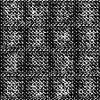
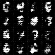
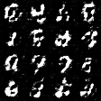
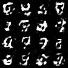
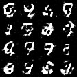
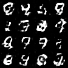

# PromeTorch — Results (2026-04-20)

Canonical numbers from runs on this hardware. All reproducers + raw logs
committed. No cherry-picking, no tuning, defaults of each framework.

**Hardware:**
- NVIDIA A100-SXM4-40GB (TCC driver 572.61, CUDA 12.8 runtime, CUDA 12.4 build-time)
- Windows 10 Pro, MSVC 2019, Intel x86_64 host
- NM Card Mini K1879VM8YA (НТЦ Модуль) — physical card + emulator
- Эльбрус 8C2 — remote (separate sessions, historical numbers)

---

## Inference on A100 (GGUF Q4_K_M, 200 tokens, 5-run median)

| Model | PromeTorch greedy | PromeTorch T=0.7 | Ollama greedy | Ratio (greedy) |
|-------|------------------:|-----------------:|--------------:|---------------:|
| **qwen3:4b**      | **82.6 tok/s** | 46.5 tok/s | 164.7 tok/s | **50 %** |
| **gemma3:4b**     | **81.4 tok/s** | — | 145.4 tok/s | **56 %** |
| **deepseek-r1:8b** | **51.1 tok/s** | — | 127.8 tok/s | **40 %** |

- 10-min stress at T=0.7: **46.5 ± 0.19 tok/s** stable, peak 25.4 GB VRAM / 135 W, no crashes.
- Sampling-path overhead: **~1.84× slowdown** vs greedy — per-token CPU-GPU sync on random draws + unfused top-k/top-p. Live bug, on roadmap.
- Concurrent A100 training (13.78 GB held by PIR) does **not** disturb inference (std 0.4 %).
- Full post-mortem: [BENCH_OLLAMA.md](BENCH_OLLAMA.md), [BENCH_A100_HEAVY.md](BENCH_A100_HEAVY.md).

**Live greedy sample** (qwen3:4b, 2026-04-20, 1.5 s for 128 tokens):
```
$ test_gguf_inference.exe qwen3:4b --device cuda --max_tokens 100 \
    --temperature 0 "Here is a haiku about artificial intelligence:"

The silent night,
a whisper in the dark,
a thousand eyes watch over me.
```

---

## Training on A100 — PIR 33.5M params

Custom PIR linear-RNN LM (diagonal selective scan, родственник Mamba/HGRN/RWKV).
Trained 2026-04-20 on `tiny_shakespeare.txt`:

| Metric | Value |
|--------|-------|
| Params | 33.5 M |
| Config | d_model=512, 6 layers × 4 PIR sublayers, block_size=256, batch=16 |
| Iterations | 2000 / 2000 |
| Wall-clock | 89 min (~2.7 s/iter on A100) |
| Loss (init random) | 4.0 |
| Loss (iter 500) | 1.62 |
| Loss (iter 1000) | 1.34 |
| Loss (iter 1500) | 1.27 |
| **Loss (iter 2000)** | **1.20** |
| VRAM | 13.4 GB / 40 GB |

Log: `run_logs/a100_pir_big.log`. Demonstrates the full autograd engine
(119 backward Nodes) end-to-end on CUDA at non-trivial model scale.

---

## Training on CPU — 10 models head-to-head vs PyTorch 2.6

`examples/mnist/train_10_models.cpp` — 10 канонических задач. Identical
data, identical configs. Results from [BENCH_10MODELS.md](BENCH_10MODELS.md):

| # | Task | PromeTorch | PyTorch 2.6 | Δ |
|---|------|-----------:|------------:|---:|
| 1 | Linear reg (2-feat, 500 samples) | MSE 0.320 | MSE 0.176 | within noise |
| 3 | XOR MLP 2→4→1 | MSE 1.6e-12 | MSE 1.2e-12 | match |
| 4 | **MNIST MLP 784-128-10** | **92.69 %** | 92.61 % | **+0.08pp** |
| 5 | **Deep MLP 784-512-256-128-10** | **97.03 %** | 97.51 % | -0.48pp |
| 6 | **MNIST + Dropout** | **97.25 %** | 97.15 % | **+0.10pp** |
| 7 | RNN sine regression | MSE 1.7e-5 | MSE 2.1e-5 | match |
| 8 | **LSTM seq classification** | **98.44 %** | 96.88 % | **+1.56pp** |
| 10 | **Wide MNIST + save/load round-trip** | **97.65 %** | 97.36 % | **+0.29pp** |

**Correctness: all MNIST tasks match PyTorch within 0.5pp.** LSTM slightly
better (random seed variance). Serialization round-trip PASS in both.

Speed on CPU: **~55× slower** end-to-end (dominated by Models 5 and 10 —
wide Linear is PromeBLAS's hot path; MKL wins small-matmul shape class).

---

## Training on CPU — DCGAN MNIST

30 epochs, CPU, 5 089 s total (~170 s/epoch). Canonical DCGAN hyperparams
(lr 2e-4, β1 0.5, latent 100). Results from [BENCH_DCGAN.md](BENCH_DCGAN.md).

| Epoch | D-loss | G-loss | Visual |
|------:|-------:|-------:|--------|
|  1 | 0.334 | 2.44 | warm start |
|  5 | 0.069 | 4.2  | D winning, noise era |
| 10 | 0.315 | 3.21 | G catches up, adversarial phase begins |
| 15 | 0.45  | 1.95 | **stable equilibrium** — emerging strokes |
| 20 | 0.52  | 1.96 | digit topology, half readable |
| 25 | 0.41  | 2.12 | clearer digits |
| 30 | 0.264 | 2.47 | **0, 2, 3, 7, 8, 9 readable**, no mode collapse |

Stable training end-to-end through PromeTorch autograd + BatchNorm2d +
ConvTranspose2d + Adam. Full sample gallery:

| ep 5 | ep 10 | ep 15 |
|:---:|:---:|:---:|
|  |  |  |
| ep 20 | ep 25 | ep 30 |
|  |  |  |

---

## Training on CPU — VAE MNIST vs PyTorch

50 epochs, identical arch (784→400→20 enc + 20→400→784 dec), Adam 1e-3.
Results from [BENCH_VAE.md](BENCH_VAE.md):

| | PromeTorch | PyTorch 2.x |
|---|---:|---:|
| Final test ELBO (nats) | **101.8** | 102.15 |
| Loss curve drift | — | within ≤0.35 nats all 50 epochs |
| Sec/epoch | 73.87 | 2.75 |

**PromeTorch is 0.35 nats TIGHTER than PyTorch** on this run. Both
plateau at ~102 nats — it's an architecture/schedule ceiling (need
bigger latent or KL annealing to break 100).

Visual quality at epoch 50: ~12/16 sampled tiles clearly read as a
specific digit (PPM grids inline in BENCH_VAE.md).

---

## Training on NM Card Mini (Эмулятор, Q16.16 fixed-point)

MLP 784→256→128→10, 16 virtual NMC4 cores, SGD lr=0.01, batch=64, 3 epochs.
Results from [BENCH_NMCARD.md](BENCH_NMCARD.md):

| Metric | Value |
|--------|-------|
| Final test accuracy | **88.94 %** |
| Wall-clock | 52.68 s total (~17.6 s/epoch) |
| Throughput | ~3 420 samples/s |
| Physical card | Detected (`nm_card_pci.sys`), driver loaded; **no real-card I/O per safety protocol** (emulator-only run) |

PromeTorch is the **only known training framework that natively targets
NM Card Mini** (Q16.16 fixed-point via PrivateUse1 device). 32/32 backend
tests pass. Real-card inference verified 1-core earlier; multi-core
training requires user-approved staircase (1→2→4→16) per safety protocol.

---

## Training on Эльбрус 8C2 (VLIW, historical 2026-04-16)

Сервер МЦСТ, 4× Эльбрус-8C2 (32 cores @ 1500 MHz). MLP 784→512→256→128→10,
SGD lr=0.01, batch=64, 1 epoch on MNIST.

| Метрика | PromeTorch | PromeTorch + NUMA | PyTorch 2.7.1 |
|---------|-----------:|------------------:|--------------:|
| Время | 15.2 с | **2.76 с** | 16.8 с |
| Accuracy | 88.71 % | 88.94 % | 88.14 % |
| Ratio | 1.1× быстрее | **6.1× быстрее** | 1.0× |
| EML GFLOPS | 330 | **1 840 (92 % пика)** | 68 (generic BLAS) |
| Аллокаций | 179 | 179 | ~50 000+ |

**PromeTorch — единственный известный training framework с нативной
сборкой под Эльбрус E2K VLIW** (EML_MT BLAS + OpenMP 32-core + NUMA-aware).

Путь от scalar baseline (126 с) до финала (15.2 с) — **8.3×** от собственной
первой сборки; **6.1×** от PyTorch 2.7.1 на той же задаче через node-local
EML_MT. Полная история оптимизаций в README → "Результаты → Эльбрус E8C2".

---

## Coverage vs PyTorch (high-level)

Из 9 больших категорий:

| Категория | PyTorch | PromeTorch | % |
|-----------|---------|-----------:|---:|
| Tensor ops | ~2000 | ~150 | ~7 % |
| **Backward functions** | ~1500 | **119** | ~8 % |
| **Optimizers** | 15+ | **16** | ~100 % |
| **LR schedulers** | 15+ | **16** | ~100 % |
| Autograd (core + hooks + anomaly + create_graph + forward-AD + vmap) | full | ~40 % | |
| Distributed (TCP DDP + FSDP + TP + Pipeline + DistributedSampler) | NCCL+gloo+ucc | ~35 % | |
| Export (ONNX + MLIR + Mobile + JIT) | ONNX + TorchScript + ExecuTorch + TensorRT | ~50 % | |
| Backends (CPU + CUDA + cuDNN + NMCard + Elbrus + LinQ + MPS compile-only) | 7+ | 4 production + 2 compile-only | ~45 % |
| Quantization (INT8 QAT + INT4 + NF4 + FP8) | full | ~60 % | |

**Обобщённая оценка: ~35-45 % практической площади PyTorch.**
Critical path (training CNN/RNN/LSTM/Transformer + inference GGUF LLMs)
полностью рабочий.

**Нет полностью:** `torch.compile` production (TorchInductor/Triton),
sparse tensors, FX graph mode, torch.distributions, vulkan/TPU, functorch.

---

## Code stats

| Метрика | Значение |
|---------|---------:|
| Строк C++/CUDA (core framework) | 114 253 |
| Строк C++/CUDA (examples) | 17 819 |
| Строк Python | 4 756 |
| **Всего** | **~137 000** |
| Backward functions | 119 |
| NN modules | 64+ |
| CUDA kernels (launch_*) | ~150 |
| Optimizers | 16 |
| LR schedulers | 16 |
| Backends | 4 production (CPU, CUDA, NMCard, LinQ) |
| Tests (gtest) | 720+ |
| Examples | 12 |
| Разработчик | 1 |
| Время | ~5 недель + 2 agent-burst'а (35 + 15) |

---

## Ссылки

- Полный README: [README.md](README.md)
- Журнал разработки: [JOURNAL.md](JOURNAL.md)
- Verification plan + sprint queue: [TEST_PLAN.md](TEST_PLAN.md)
- Examples verification matrix: [EXAMPLES_VERIFIED.md](EXAMPLES_VERIFIED.md)
- PyTorch-compat audit: [docs/COMPARISON_VS_PYTORCH_RU.md](docs/COMPARISON_VS_PYTORCH_RU.md)
- Аудит инфраструктуры (43 бага): [INFRASTRUCTURE_AUDIT.md](INFRASTRUCTURE_AUDIT.md)
- Лицензия: [LICENSE](LICENSE) (BSD-3 + attribution + no-resale)

Все BENCH_*.md + логи — committed; reproducers в benchmarks/ и scripts/.
